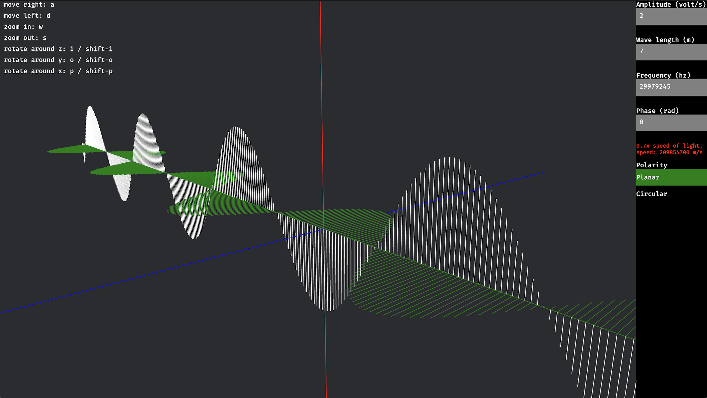

# Waves

Simulations using the [bevy game engine](https://bevyengine.org)

## Electromagnetic wave



```
cargo run
```

Web:

```
cargo build --target wasm32-unknown-unknown
wasm-bindgen --out-name wasm_example \
 --out-dir target \
 --target web target/wasm32-unknown-unknown/debug/things.wasm
python -m http.server 8888
```

## Contribute

1. Fork
2. Commit changes to a branch in your fork
3. Push your code and make a pull request
